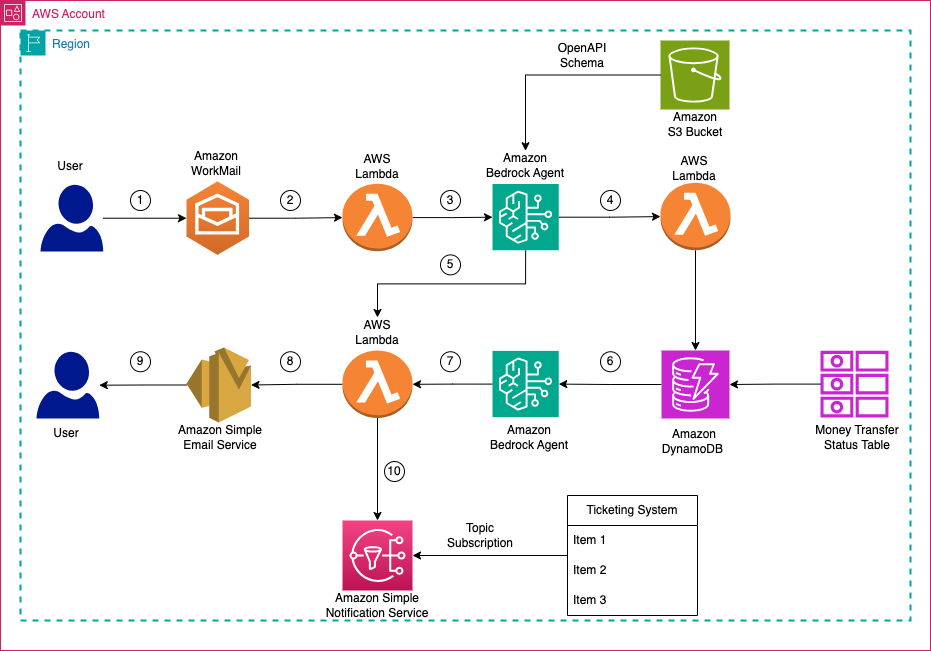
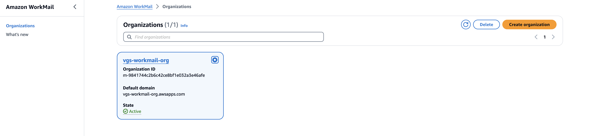

# Elevating Customer Experience through Intelligent Email Automation Solution using Amazon Bedrock

This project is developed to showcase how Amazon Bedrock Agent can be used to classify the incoming email and respond back to the customer automatically using GenAI. 

Supporting customer via email channel is one of the big task for every organization sinch it involves human resources, space, devices,and other technologies. Also, this is very expensive process and not addressing customer queries leads to huge customer churnout and impacting the revenue and reputation of the organization. 

Customers frequently raise basic inquiries that don't necessarily warrant a direct response from customer care representatives, unless the request is critical or sensitive. To streamline this process, Amazon offers the Bedrock Agent, a fully managed AWS service that leverages Generative AI (GenAI) capabilities. This service helps classify and extract relevant entities from customer input prompts or contexts, allowing it to connect with external applications and fulfill specific tasks. In this project, we utilized Amazon WorkMail to receive customer emails, which subsequently triggered a Lambda function. This function passed the email content to the Amazon Bedrock Agent for classification and entity extraction. Specifically, the Bedrock Agent was tasked with identifying transaction IDs mentioned in the customer email content. Once the transaction ID was extracted, the Bedrock Agent queried a DynamoDB table to retrieve the corresponding payment status for that transaction. Based on the retrieved payment status and the classified nature of the customer's inquiry, the Bedrock Agent generated an intelligent, natural language response.

This response, tailored to address both known and unknown requests, was then sent back to the customer via email using the integrated Amazon WorkMail service.

## Process Flow / Architecture Diagram



## CDK project structure :
The solution comprised of three cdk stacks.

* `WorkmailOrgUserStack` : Creates the Amazon workmail with domain, user, inbox access.
* `BedrockAgentCreation` : Creates the Amazon Bedrock Agent, Agent Action Group, OpenAPI Schema, S3 Bucket, DynamoDB Table, Agent Group Lambda for gettng the transfer status from DynamoDB .
* 'EmailAutomationWorkflowStack': Creates the classification lambda which interact with Amazon Bedrock Agent and Integration Lambda which is integrated with Amazon Workmail.

## Pre-requisites
* AWS CLI >= 2.15.34 (Please follow [Installing or updating the latest version of the AWS CLI
](https://docs.aws.amazon.com/cli/latest/userguide/install-cliv2-linux.html#cliv2-linux-upgrade) guide to install/upgrade AWS cli)
* AWS CDK command line utility (2.135.0) (Please follow [Getting started with the AWS CDK](https://docs.aws.amazon.com/cdk/latest/guide/getting_started.html) guide to install/upgrade cdk.)
* Python>=3.11.8

**Note:** You can deploy these stacks in us-east-1(N.Virginia) or us-west-2(Oregon) or eu-west-1(Ireland) (Amazon workmail available only in these 3 regions)

## Steps to deploy the project
1. Clone the repository.

```
git clone git@github.com:aws-samples/email-intelligent-automation-bedrock.git
```

2. This project is set up like a standard Python project. To create the virtualenv it assumes that there is a python3 (or python for Windows) executable in your path with access to the venv package. create the virtualenv using following command.
```
$ python3 -m venv .venv 
```

3. Use the following step to activate your virtualenv.
```
$ source .venv/bin/activate
```
If you are a Windows platform, you would activate the virtualenv like this:
```
% .venv\Scripts\activate.bat
```
Once the virtualenv is activated, you can install the required dependencies.
```
$ pip install -r requirements.txt
```
4. Deploying the solution :

Deploying the Amazon workmail with domain, user, inbox access : Execute following command by passing optional paramaters
```
# Make sure to update the AWS_REGION to use one of the region where workmail is available. Say, 

export AWS_REGION=us-east-1 # Amazon workmail available only in us-east-1(N.Virginia) or us-west-2(Oregon) or eu-west-1(Ireland)

cdk deploy WorkmailOrgUserStack  --parameters OrganizationName=<Organization Name> --parameters UserName=<Support Username> --parameters PassWord=<Password>
```

Arguments to the stack creation :
* `OrganizationName` :(optional) Name of the workmail organization. If not entered, default name 'my-sample-workmail-org-<random-suffix>' will be used. Domain also will be created using this organization alias name. 
* `UserName` :(optional) Name of the your organization support user alias. If not entered, default user name 'support' will be used.
* `PassWord` : (optional) Password for the UserName. If not entered, default password 'Welcome@123' will be used.

# Export the support email address from the previous stack to an environment variable which is used in the later stage.
```
export SUPPORT_EMAIL=$(aws cloudformation describe-stacks --stack-name WorkmailOrgUserStack --query 'Stacks[0].Outputs[?OutputKey==`ResponseMessage`].OutputValue' --output text)
```

Deploying Amazon Bedrock Agent, Alias, Action Group, OpenAPI Schema and Lambda function: Execute following command by passing optional paramaters
```
cdk deploy BedrockAgentCreation --parameters AgentName=<Bedrock Agent Name> --parameters ModelName=<Bedrock Claude Model Name>
```
Arguments to the stack creation :
* `AgentName` :(optional) Name of the Amazon Bedrock Agent. Default name is "my-email-bedrock-agent"
* `ModelName` :(optional) Name of the Amazon Bedrock Claude Model. Default model is "anthropic.claude-3-sonnet-20240229-v1:0"

# Export the agentID and agentAliasID from the previous stack to an environment variable which is used in the later stage.

export AGENT_ID=$(aws cloudformation describe-stacks --stack-name BedrockAgentCreation --query 'Stacks[0].Outputs[?OutputKey=='CustomResourceAgentId'].OutputValue' --output text)

export AGENT_ALIAS_ID=$(aws cloudformation describe-stacks --stack-name BedrockAgentCreation --query 'Stacks[0].Outputs[?OutputKey=='CustomResourceAgentAliasId'].OutputValue' --output text)

# Update your email address to which will receive the SNS notification.
export MY_WORKFLOW_EMAIL_ID= < Workflow Email Address>

Deploying Integration Lambda for Amazon WorkMail and Classification Lambda to call Amazon Bedrock Agent programitically: Execute following command 

```
cdk deploy EmailAutomationWorkflowStack --parameters AgentID=$AGENT_ID --parameters AgentAliasID=$AGENT_ALIAS_ID --parameters humanWorkflowEmail=$MY_WORKFLOW_EMAIL_ID --parameters supportEmail=$SUPPORT_EMAIL
```
Arguments to the stack creation :

* `AgentID` (required) : Output from the previous stack "BedrockAgentCreation" deployment. This is to refer Amazon Bedrock Agent ID to classification lambda.
* `AgentAliasID` (required) : Output from the previous stack "BedrockAgentCreation" deployment. This is to refer Amazon Bedrock Agent Alias ID to classification lambda.
* `humanWorkflowEmail` (required) : email id to receive the SNS notification if customer email content does not match with any classifcation. The email id will subscribe from SNS topic and SNS will publish unclassified email to the topic. 
* `supportEmail` (required) : Output from the previous stack "WorkmailOrgUserStack" deployment (in this case, it is stored in SUPPORT_EMAIL variable). This email id will receive email from the customer and invoke the lambda function.


Note : Please note that these three deployments approximately 20 to 25 minutes

After the stacks are succefully deployed (You can see if there is an error as the cdk output otherwise it says stacks creation succeful.), please open the .ipynb notebook from Sagemaker notebook instance and execute all the scripts in the notebook in sequence. 


#### Setting up the Inbound rules in Amazon Workmail using the lambda function generated in previous stack :

1. Go to Amazon Workmail service and click the organization from the left panel and choose the organization created.



2.	Click on ‘Organization Settings’ from the left panel menu and you will see the web-application link for your email in user login section.


2.	Click on that web-application URL to login and enter the username and password and Sign In.


3.	You will see your Email inbox web page.


4.	Test this new email box by sending email from your personal email id.

5.	Setting up Inbound Rules:

* Click on ‘Organization Settings’ and choose the ‘Inbound Rules’ menu
* Click the button ‘Create rule’
* Enter the Rule Name and Select the action ‘Run Lambda’ and choose ‘Custom Lambda function’ and select the lambda function generated in the previous stack deployment. Function name will be "workmail-integration-lambda-fn + some random letters"
* This Lambda function will be invoked upon receiving the email on this domain	
* Enter * in both Sender domain and destination domain


Currently 3 type of custom email classifications will be used for automated response to customer email.
1. MONEYTRANSFER  - Customer email contains query about the money transfer
2. PASSRESET - Customer email contains query related to login, account locked or password request
3. PROMOCODE - Customer email contains query related to discount or promo available for the money transfer
If the customer email does not belong to any of the above classifcation, customer email will be sent to SNS topic and whoever subscribe the topic will receive the message.  In our testing we subscribe with email we passed with human_workflow_email parameter(ex: your presonal email) to verify the mail has been moved to SNS topic.

## Testing the solution 
* **Step1**: send the email to the customer support email box (ex: support@my-sample-workmail-org.awsapps.com) from your personal email to query about the money transfer status. 
* Example email content: 
```
Subject: 'Money Transfer Status'  Body: 'Hi Team , Can you please check the status of money tranfer I sent to India? This is my trx id : MTN0000123 Regards CustomerX'
```

* **Step2**: Check your workmail inbox and you can see the email sent from your personal email.

* **Step3**: You can see the automatic email response back to you personal email with your money transfer status with same subject. 
```
Dear Customer, Hope you are looking for the status of your money transfer. Status of your MTN0000123 is INPROGRESS. If this is not right information you are looking for, please reply back to this email with little more information
```

* **Step4**: Try sending email with your own subject and body related to above three classications. You will see the different email response based classification results.

* **Step5**: Try sending email with your own subject and busy not related to above classifications. 
```
Ex: Hello, can you help me to solve my problem?. You will see your email has been moved to SNS topic and you can confirm that by see the email content in your human workflow email you given during the stack creation.
```

## Clean up :

To avoid incurring ongoing costs, delete the resources you created as part of this solution bye executing following commands in order. 

1. `cdk destroy EmailAutomationWorkflowStack`

2. `cdk destroy BedrockAgentCreation`

3. `cdk destroy WorkmailOrgUserStack`

## Security

See [CONTRIBUTING](CONTRIBUTING.md#security-issue-notifications) for more information.

## License

This library is licensed under the MIT-0 License. See the LICENSE file.

Enjoy!
